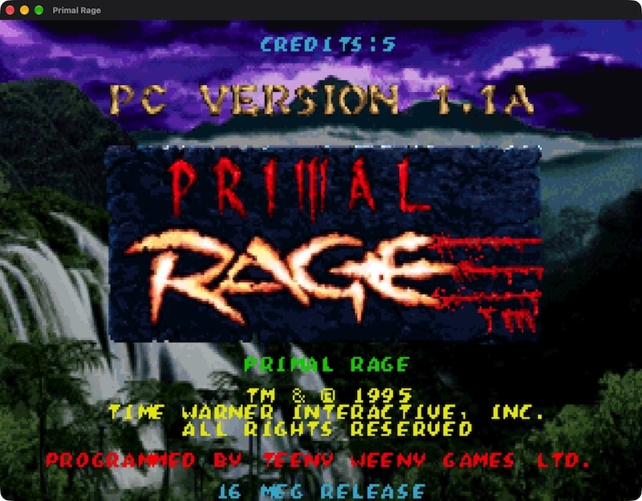

# Primal Rage (DOS, 1995) — Reverse Engineering 64%



Reverse engineering of **Primal Rage**'s PC/DOS release (Time Warner
Interactive / Probe Software / Teeny Weeny Games, 1995), targeting `PRAGE.EXE`
and the `S16*.GRA` graphics set.

It is a **32-bit protected-mode WATCOM C/C++32 program** shipped as a
**Microsoft DOS/4GW *bound* Linear Executable (LE)**. There is no 16-bit real
mode game code: everything interesting lives in two LE objects (code + data).

## Game assets

The original game files are **not included** in this repository and are
required to build, run, or reverse-engineer anything here. Download them (e.g. from
[myabandonware](https://www.myabandonware.com/game/primal-rage-2vr)) and
place them under `data/game/C/` (`PRAGE.EXE`, `INDEX`, `S16*.GRA`, sound
drivers). `data/` is git-ignored and read-only — the tools and tests never
write to it.

## Layout

| Path | What |
|---|---|
| `docs/PROGRESS.md` | Detailed, continuously-updated status: what's ported, verified, and every named gap |
| `data/game/C/` | Installed game (`PRAGE.EXE`, `INDEX`, `S16*.GRA`, sound drivers) |
| `data/game/CD/RAGECD.ISO` | Original CD (`/Volumes/RAGECD` when mounted: `RAGE.S04`, `RAGE.S08`, `RAGE.S16`, `RAGE.SND`) |
| `port/` | SDL3 port: engine core, audio/AIL, Smacker video, sprite/actor/render, EEPROM/config, front-end input/credits/select — `cmake -S port -B build` |
| `port/src/platform/audio/` | AIL surface, XMIDI sequencer, FAT.OPL, samples, mixer, vendored OPL core |
| `port/RE_GUIDE.md` | Address conventions, DOS/4GW layout, toolchain, landmarks |
| `port/spec/game_flow.md` | Entry, frame loop, state machine, tick, pixel path |
| `port/PORTING.md` | Porting rules (memory model, `mem[]` discipline, `fn_resolve`) |
| `port/DECOMPILATION.md` | Exact dependencies and steps used to produce `port/decomp/` |
| `port/decomp/prage.c` | Ghidra decompilation of every function (via the lx-loader) |
| `port/decomp/prage.functions.csv` | Function index: entry, size, callers, callees |
| `port/decomp/prage.strings.csv` | Defined strings with cross-references |
| `port/decomp/prage.symbols.csv` | User-defined / imported symbols |
| `docs/FORMATS.md` | Decoded on-disk formats (LE layout, `INDEX`, `GRA`) |
| `docs/THIRD_PARTY_LICENSES.md` | Vendored third-party code and licences |
| `docs/superpowers/` | Sub-project specs, plans and the engine-core report |
| `tools/le_info.py` | Dump the LE header/objects and decode `INDEX` |
| `tools/gra_render.py` | Independent GRA decoder + frame oracle (`--indices`, `--frame`) |
| `tools/gra_extract.py` | Extract every S16 sprite to RGBA PNG + `manifest.json` (`make re-extract`) |
| `tools/gen_symbols.py` | Generate `port/src/symbols.h` from the decompilation |
| `_tools/ghidra_scripts/` | Ghidra headless scripts used to produce the artefacts |
| `Makefile` | `make help` — PORT (`build`/`test`/`check`/`run`/`verify`) and RE targets |

## Toolchain

* **Ghidra 12.2** with the [`ghidra-lx-loader`](https://github.com/yetmorecode/ghidra-lx-loader)
  extension (LE/LX loader, DOS/4GW aware), installed at
  `~/ghidra_12.2_DEV/Extensions/Ghidra/ghidra-lx-loader` and
  `~/Library/ghidra/ghidra_12.2_DEV/Extensions/ghidra-lx-loader`. It maps
  object 0 to `0x10000` (code) and object 1 to `0x80000` (data) and applies the
  LE fixups, so no manual image extraction is needed.
* **JDK 25** (`temurin-25`) for Ghidra 12.2.
* **dosbox-x** for ground truth (memory layout, runtime behaviour).
* Python 3 with `capstone` for ad-hoc disassembly checks and `Pillow` for `tools/gra_extract.py`.

### Regenerate the decompilation

```bash
export JAVA_HOME=/Library/Java/JavaVirtualMachines/temurin-25.jdk/Contents/Home
G=/Users/felipe.dos.santos/ghidra_12.2_DEV/support/analyzeHeadless

# one-shot import + analysis (the loader auto-detects the LE)
$G _tools/ghidra_proj prage -import data/game/C/PRAGE.EXE -overwrite \
   -scriptPath _tools/ghidra_scripts

# make .object1 executable, create the entry function, export everything
$G _tools/ghidra_proj prage -process PRAGE.EXE \
   -scriptPath _tools/ghidra_scripts \
   -postScript FixupProgram.java \
   -postScript ExportDecomp.java port/decomp/prage.c 90 \
   -postScript ExportMeta.java port/decomp/
```

## Status

`PRAGE.EXE` (~1350 functions) and its `S16*.GRA` graphics set are fully
decompiled (`docs/FORMATS.md`, `port/decomp/`). The SDL3 port reimplements the
engine in C over a flat `mem[]` holding the original data image at its
original addresses (`port/PORTING.md`) and currently covers boot through the
title screen, the front end and the attract demo — each gated by a byte-exact
oracle against the original's own captured frames (`make verify`). Real
interactive gameplay is not yet ported and has no oracle to verify it against.

**64%** (770 of 1203) of the original's real functions have a ported,
header-commented counterpart in `port/src/` (see `AGENTS.md` for how that
figure is computed). The 433 that are not are not porting targets: 81 are
host-owned or deferred (`tools/port_classification.txt`, each with its
evidence) and the other 352 are WATCOM libc and DOS/4GW runtime code (at or
above `0x5D000`, served by the host libc). Excluding them, **100%** (731 of
731) of the portable functions are ported.
For the detailed, continuously-updated status — what's ported, what's
verified, and every named gap with its evidence — see
**[`docs/PROGRESS.md`](docs/PROGRESS.md)**. The underlying raw-byte
derivations live in `docs/superpowers/plans/2026-09-24-demo-pose-derivations.md`.

## Build and run

```bash
cmake -S port -B build && cmake --build build     # or: make build
./build/prageport --game-dir data/game/C          # windowed; ESC to quit
./build/prageport --game-dir data/game/C --check 60
```

The window opens at 1024x768 (4:3, the original's CRT aspect) and is
user-resizable; the 320x200 frame is scaled to fill it (nearest-neighbour, to
keep the pixels hard). This is host policy, not from the original — see the
`PORT:` note in `host.c`.

The windowed run opens the audio device with the window at the FM core's native
49716 Hz stereo rate; if no device can be started it prints SDL's reason and
continues silently (audio is otherwise unconditional — there is no sound flag).
`SDL_AUDIODRIVER=dummy` exercises the open path on a headless machine.

`--check N` runs exactly N master-loop iterations with no window and no audio
device, writing `frame_NNNN.ppm` (RGB), `frame_NNNN.pal` (the DAC) and
`frame_NNNN.idx` (raw indices) per frame, and exits non-zero on an internal
assertion failure. Because boot runs the state-0 attract first, the title facts
(announcer voice, music notes, non-blank drawn frames) are asserted relative to
the title entry, so a short attract-only run is still valid; `make verify` uses
`--check 820` to cross the attract and exercise them.

### Verify

```bash
PR_ORACLE_REQUIRED=1 ./build/run_tests            # or: make verify
```

`PR_ORACLE_REQUIRED=1` is required for a real verification run: the byte-exact
Ghidra/Smacker/title oracles are git-ignored copies of the game's own bytes, so
without it the suite skips those comparisons. `make verify` runs the full ladder
in order — a `--check 820` headless smoke run (crossing the boot attract into
the title), the oracle-required test suite, `make smk-oracle`, `make
title-oracle`, the GRA-extract oracle tests, and `symbols.h` idempotence.

The title oracle compares the port dump against captures of the **overlay-live**
original (four behaviour pins retained; the ported overlay runs):

```bash
make title-pin                                   # patch only the four behaviour sites (three entry RNG draws + the anim opcode-8 draw) into /tmp/pr_title_pin/PRAGE.EXE (writes /tmp only)
make title-oracle                                # align the port dump into data/title-captures/* and compare
```

With two independent captures under `data/title-captures/`, it proves both the
pixel match (every captured frame is a byte-offset splice of two adjacent port
frames, zero tolerance) and determinism (the captures agree on the clean
samples). With `PR_ORACLE_REQUIRED=1` and fewer than two captures it fails
rather than reporting the proof incomplete.

The attract oracle compares the same continuous run's state-0 prefix against
those post-logo captures, with the attract window derived as the capture frames
before the title window (0..215):

```bash
PR_ATTRACT_DUMP=/tmp/pr_attract PR_GAME_DIR=data/game/C ./build/run_tests
python3 tools/attract_compare.py --capture data/title-captures/title \
    --capture data/title-captures/title2 --port /tmp/pr_attract
```

The comparator matches capture frames 0..214 and reports its first divergence at
the last attract frame 215 (raw 2180/2175) — the next unregistered animation
inline code pointer after `0x10FA8` (the hand-off spawn, now implemented), an
individually explained, declared divergence, not a silent skip. The
palette-animation starter `0x4F83C`/`0x10FC4` and the scene-palette driver
`0x4F7F4` are ported (small-fidelity-gaps cycle) but do not run
(`DS_00104AD0` bit 0 is never set), so the 215 divergence is unmoved. The
`PR_ATTRACT_DUMP` run also writes the title window to `/tmp/pr_attract/title`,
so `title_compare` can run on the same dump.

## Third-party

The FM synthesiser is vendored: **opal 2.0.3**, MIT
(`https://github.com/RealBitdancer/opal`, commit `7e829f33`); its synthesis core
is by Shayde/Reality (Reality Adlib Tracker 2), public domain. It lives at
`port/src/platform/audio/opl/` with its licence at `opl/LICENSE.opal.txt`; the
files are byte-identical to upstream apart from a provenance banner. See
`docs/THIRD_PARTY_LICENSES.md`.
